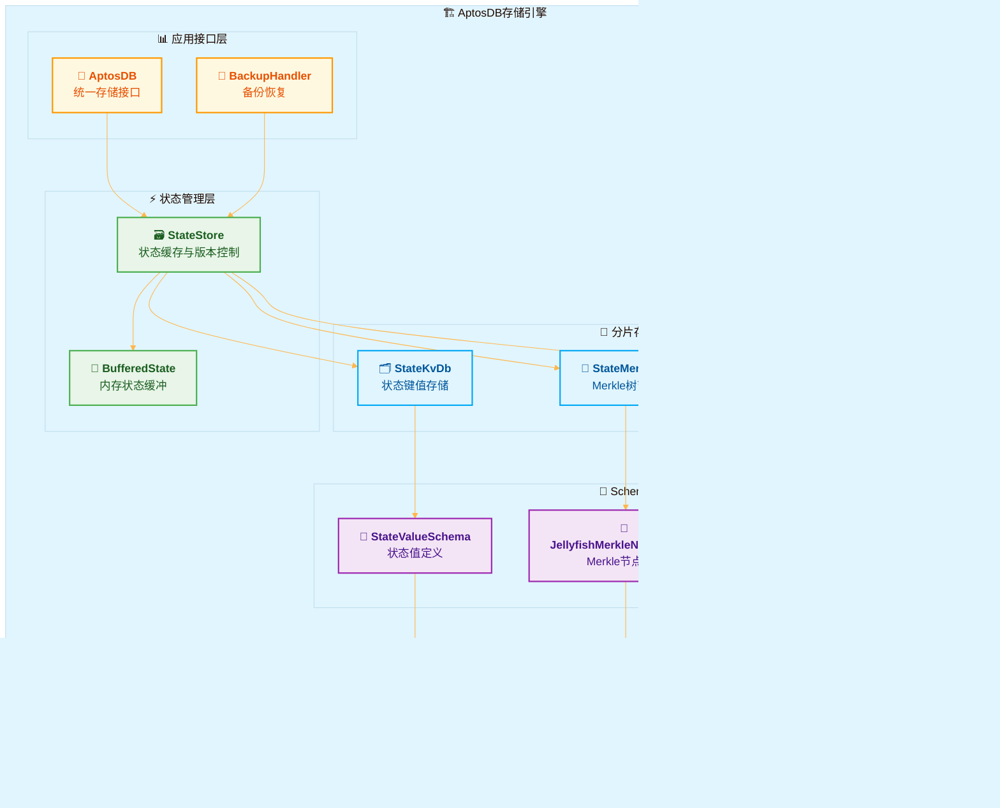

# AptosDB存储引擎源码解析

## Aptos存储系统全景

在深入分析AptosDB存储引擎的技术细节之前，我们需要建立对整个Aptos存储生态系统的全局认知。

### Aptos存储系统的四大核心支柱

**支柱一：AptosDB存储引擎**
AptosDB作为整个存储体系的基础设施，负责数据的持久化、查询优化、并发控制和生命周期管理。它采用分层架构设计，每层都针对特定的技术挑战进行深度优化。

**支柱二：Jellyfish Merkle Tree状态认证系统**
JMT为区块链状态提供密码学保证，支持状态证明的生成和验证。它与AptosDB的深度集成确保了状态数据的完整性和可验证性，为轻客户端和跨链互操作提供了技术基础。

**支柱三：累加器数据结构的数学保证**
累加器系统为区块链历史提供了数学级别的完整性保证。通过创新的冻结子树算法和Position编码技术，实现了$O(log n)$的空间复杂度和$O(1)$的平均追加性能。

**支柱四：备份恢复系统的可靠性保障**
企业级的备份恢复机制确保了关键数据的安全性和系统的业务连续性。多阶段恢复算法和密码学完整性验证为生产环境的稳定运行提供了坚实保障。

### 四大组件的协作机制与数据流向

这四个核心组件并非简单的功能叠加，具体协作流程如下：

1. **数据写入流程**：应用层的状态更新首先经过AptosDB的BufferedState缓存，然后通过分片写入算法并行更新StateKvDb和StateMerkleDb，同时JMT负责维护状态的Merkle根，累加器确保交易历史的完整性。
2. **查询响应流程**：状态查询优先从AptosDB的内存缓存获取数据，缓存未命中时访问持久存储；需要历史证明时，JMT和累加器协作生成相应的密码学证明。
3. **备份同步流程**：备份系统通过RestoreCoordinator协调各个存储组件，确保数据的一致性备份和快速恢复，同时利用累加器的范围证明验证备份数据的完整性。


## 1. 存储引擎架构全景

从代码实现来看，AptosDB的架构设计采用了以下几个主要原则：

- **分层解耦**: 每层负责特定功能，层间通过接口交互。这种设计允许各层独立开发和优化。例如，RocksDB层的压缩策略可以单独调整，不需要修改上层的状态管理代码。
- **水平分片**: 使用分片策略处理大规模数据存储。当状态数据增长时，系统可以通过增加分片来分散存储压力。分片基于状态键的哈希值进行，能够相对均匀地分布数据。
- **版本化存储**: 为每个区块高度维护状态快照。这种设计支持历史状态查询，同时为状态同步和回滚操作提供了实现基础。每个版本对应特定的区块高度，保证状态的可追溯性。
- **访问模式优化**: 根据区块链系统的访问特点进行优化。区块链系统通常有大量状态读取和批量状态更新的特点，因此采用了相应的缓存策略、批处理机制和并发控制方法。

### 1.1 存储引擎分层架构概述

在深入分析AptosDB存储引擎的技术细节之前，我们首先需要理解一个根本问题：为什么区块链存储系统需要如此复杂的分层设计？

传统数据库系统的设计目标相对单纯：高效处理CRUD操作，保证ACID特性。但区块链存储系统面临着更为复杂的挑战组合：它既要满足传统数据库的性能要求，又要提供密码学级别的数据完整性保证，同时还要支持历史状态的精确查询和高并发的状态验证操作。

AptosDB存储引擎正是为了应对这种多维度挑战而采用分层架构设计的。基于RocksDB构建的这套系统，不仅要处理传统数据库的CRUD操作，更要满足区块链系统对数据一致性、可验证性和高并发的严格要求。

分层架构通过将不同关注点分离到不同层次，使每层专注于特定问题：底层处理数据持久化，中层管理状态组织，上层提供业务接口。这种设计使得各层可以独立演进，降低了系统复杂度。

从源码结构分析，这六层架构是按照数据流向和抽象层次自然形成的：

1. **应用接口层 (AptosDB)**：作为整个存储引擎的统一入口，协调各个子组件的工作。它封装了底层复杂性，为上层应用提供简单一致的接口。主要处理事务的开始、提交和回滚，以及备份恢复等跨组件操作。
2. **状态存储层 (StateStore)**：管理区块链状态的读写操作，是性能关键层。它维护内存中的状态缓存，处理版本控制，并与Jellyfish Merkle Tree集成以支持状态证明生成。这一层解决了状态访问的高频需求。
3. **分片存储层**：将大规模状态数据分布到多个存储分片中，解决单点性能瓶颈。StateKvDb处理键值数据，StateMerkleDb管理Merkle树节点，两者协作支持水平扩展。
4. **账本数据层 (LedgerDb)**：存储区块链的核心数据，包括交易、事件和元数据。与状态层分离，使得账本数据和状态数据可以采用不同的优化策略。
5. **Schema抽象层**：定义数据的序列化格式和索引结构，为上层提供类型安全的数据访问接口。它隐藏了底层存储格式的细节，支持数据格式的演进。
6. **RocksDB存储层**：提供高性能的键值存储能力，采用LSM树结构优化写入性能。处理数据压缩、持久化等底层存储细节。

### 1.2 与Jellyfish Merkle Tree的集成

AptosDB与Jellyfish Merkle Tree(JMT)进行了集成，用于实现状态验证和同步。


JMT是为区块链系统设计的数据结构，与AptosDB的LSM树存储引擎配合使用。集成的目的是在保证数据完整性和可验证性的同时，提供状态管理功能。以下是StateStore结构的实现：

```rust
// storage/aptosdb/src/state_store/mod.rs:114-127
// StateStore: 状态存储管理器，负责协调内存缓存和持久化存储
pub(crate) struct StateStore {
    // 状态数据库实例，提供底层存储能力
    pub state_db: Arc<StateDb>,
  
    /// 缓冲状态管理：buffered_state的base是state_merkle_db中的最新快照，
    /// 而current是从该快照重放到ledger_db中最新写入集的最新状态稀疏默克尔树
    /// 使用Mutex确保并发访问的线程安全性
    buffered_state: Mutex<BufferedState>,
  
    /// 当前状态在StateStore和buffered_state之间共享
    /// 在读取时，无需锁定buffered_state即可获取最新状态
    /// Arc<Mutex<T>>模式：Arc提供共享所有权，Mutex提供互斥访问
    current_state: Arc<Mutex<LedgerStateWithSummary>>,
  
    /// 跟踪持久化的稀疏默克尔树，任何比此更旧的状态都保证可以在RocksDB中找到
    /// 这是缓存与持久化存储之间的分界线
    persisted_state: PersistedState,
  
    /// 缓冲状态目标项数：控制内存中缓存的状态项数量，用于内存使用优化
    buffered_state_target_items: usize,
  
    /// 可选的内部索引器数据库，提供额外的查询索引能力
    internal_indexer_db: Option<InternalIndexerDB>,
}
```

### 1.3 存储引擎关键组件映射

基于源码结构分析，存储引擎的关键组件及其源码位置如下：

| 组件                    | 源码路径                                   | 核心职责         | 关键数据结构                                 |
| ----------------------- | ------------------------------------------ | ---------------- | -------------------------------------------- |
| **AptosDB**       | `storage/aptosdb/src/db/mod.rs`          | 存储引擎总入口   | `AptosDB`, `BackupHandler`               |
| **StateStore**    | `storage/aptosdb/src/state_store/mod.rs` | 状态存储管理     | `StateStore`, `BufferedState`            |
| **StateKvDb**     | `storage/aptosdb/src/state_kv_db.rs`     | 键值对状态存储   | `StateKvDb`, `ShardedStateKvSchemaBatch` |
| **StateMerkleDb** | `storage/aptosdb/src/state_merkle_db.rs` | Merkle树节点存储 | `StateMerkleDb`, `NodeBatch`             |
| **LedgerDb**      | `storage/aptosdb/src/ledger_db/mod.rs`   | 账本数据管理     | `LedgerDb`, `TransactionStore`           |
| **Schema系统**    | `storage/aptosdb/src/schema/`            | 数据结构定义     | 各种Schema定义                               |
| **修剪器**        | `storage/aptosdb/src/pruner/`            | 数据生命周期管理 | `PrunerManager`, `StateKvPruner`         |

这种组件划分体现了**领域驱动设计**和**单一职责原则**，每个组件都有明确的边界和职责。

## 2. 核心数据结构深度解析




### 2.1 AptosDB主结构分析

AptosDB作为存储引擎的主要入口，需要协调多个复杂的子系统：状态管理、交易存储、事件处理、数据修剪等。采用组合模式而非继承的原因是每个子系统都有独特的优化需求和生命周期管理要求。

**组件设计的必要性**：

区块链存储系统需要同时处理多种类型的数据，每种数据有不同的访问模式：

- 状态数据：读多写少，需要快速查询和证明生成
- 交易数据：写入密集，需要高效的批量插入
- 事件数据：主要用于索引和查询，需要良好的范围查询性能

将这些功能分离到不同组件中，可以为每种数据类型采用最适合的存储策略和优化方法。

**AptosDB结构定义**：

```rust
// storage/aptosdb/src/db/mod.rs:89-104
/// AptosDB：Aptos区块链的核心存储引擎
/// 持有负责物理存储的底层数据库句柄，并提供访问核心Aptos数据结构的API
pub struct AptosDB {
    /// 账本数据库：存储区块、交易、元数据等核心账本信息
    /// Arc<T>：原子引用计数智能指针，支持多线程安全的共享所有权
    pub(crate) ledger_db: Arc<LedgerDb>,
  
    /// 状态键值数据库：专门存储区块链状态的键值对数据，优化状态查询性能
    pub(crate) state_kv_db: Arc<StateKvDb>,
  
    /// 事件存储：管理智能合约执行产生的事件数据，支持事件查询和订阅
    pub(crate) event_store: Arc<EventStore>,
  
    /// 状态存储：核心状态管理组件，处理状态缓存、版本控制和Merkle树集成
    pub(crate) state_store: Arc<StateStore>,
  
    /// 交易存储：优化交易数据的存储和检索，提供高效的交易查询能力
    pub(crate) transaction_store: Arc<TransactionStore>,
  
    /// 账本修剪器管理器：负责历史数据的生命周期管理，防止存储无限增长
    ledger_pruner: LedgerPrunerManager,
  
    /// RocksDB属性报告器：监控底层RocksDB的性能指标和运行状态
    /// 下划线前缀表示该字段主要用于副作用，不直接访问
    _rocksdb_property_reporter: RocksdbPropertyReporter,
  
    /// 预提交锁：检测pre_commit_ledger()的并发调用，确保预提交操作的独占性
    /// std::sync::Mutex<()>：标准库互斥锁，()表示不需要保护具体数据，只需要锁机制
    pre_commit_lock: std::sync::Mutex<()>,
  
    /// 提交锁：检测commit_ledger()的并发调用，保护最终提交过程的原子性
    commit_lock: std::sync::Mutex<()>,
  
    /// 可选索引器：提供额外的数据索引功能，支持复杂查询需求
    indexer: Option<Indexer>,
  
    /// 跳过索引和使用统计：性能优化标志，可以跳过某些索引操作以提升性能
    skip_index_and_usage: bool,
  
    /// 更新订阅者：状态更新的通知机制，支持外部系统订阅存储变更事件
    /// Sender<(Instant, Version)>：发送时间戳和版本号的通道发送端
    update_subscriber: Option<Sender<(Instant, Version)>>,
}
```

**核心存储组件**：

- `ledger_db`: 管理账本数据（交易、区块、元数据），是数据的权威来源
- `state_kv_db`: 存储状态键值对数据，优化状态查询性能
- `state_store`: 状态管理中枢，处理状态缓存、版本控制和Merkle树集成
- `event_store`: 专门处理合约事件，支持事件查询和订阅
- `transaction_store`: 优化交易数据的存储和检索

**系统协调机制**：

- `ledger_pruner`: 管理历史数据的清理，防止存储无限增长
- `pre_commit_lock` /`commit_lock`: 保护关键的提交流程，确保数据一致性
- `_rocksdb_property_reporter`: 监控底层RocksDB的性能指标

**可选功能**：

- `indexer`: 可选的索引服务，为查询提供额外的索引支持
- `skip_index_and_usage`: 配置标志，可以跳过某些索引操作以提升性能
- `update_subscriber`: 状态更新的通知机制，支持外部系统订阅变更

#### **组件协作流程**：

当处理一个区块提交时，这些组件按以下顺序协作：

1. `pre_commit_lock` 确保提交操作的独占性
2. `transaction_store` 和`event_store` 处理交易和事件数据
3. `state_store` 更新状态数据并生成新的Merkle根
4. `ledger_db` 记录新的区块信息
5. `commit_lock` 保护最终提交过程
6. `update_subscriber` 通知外部系统状态变更

#### **结构设计模式分析**：

AptosDB的结构设计体现了现代分布式系统的几个重要设计模式：

##### **1. 微服务架构模式的应用**：
虽然AptosDB在单一进程中运行，但其内部组件的设计借鉴了微服务架构的思想。每个核心组件（LedgerDb、StateStore、EventStore等）都具有明确的服务边界、独立的数据存储和专门的API接口。这种设计的优势在于：

- **故障隔离**：单个组件的问题不会直接影响其他组件的正常运行
- **独立优化**：每个组件可以根据其特定的工作负载进行性能调优
- **并行开发**：不同团队可以并行开发不同的组件而不产生冲突

##### **2. CQRS（命令查询职责分离）模式的体现**：
AptosDB在设计上明确区分了写入路径和读取路径：

```rust
// 写入路径：通过BufferedState进行批量状态更新
state_store: Arc<StateStore>,     // 负责状态的写入和管理
ledger_db: Arc<LedgerDb>,        // 负责交易数据的持久化

// 读取路径：通过专门的存储组件提供高效查询
state_kv_db: Arc<StateKvDb>,     // 优化状态键值查询
event_store: Arc<EventStore>,     // 优化事件查询和过滤
```

这种分离使得系统可以分别优化读取和写入性能，避免了传统CRUD操作中读写冲突的问题。

##### **3. 观察者模式与事件驱动架构**：
`update_subscriber: Option<Sender<(Instant, Version)>>`字段实现了观察者模式，支持外部系统订阅存储状态的变更。这种设计：

- **解耦系统组件**：订阅者无需直接依赖AptosDB的内部实现
- **支持实时响应**：外部系统可以实时响应状态变更
- **扩展性良好**：可以轻松添加新的订阅者而不影响核心存储逻辑

##### **4. 资源生命周期管理的系统性设计**：
通过 `ledger_pruner: LedgerPrunerManager`，AptosDB实现了数据生命周期的自动化管理。这解决了区块链系统面临的一个根本挑战：如何在保证数据完整性的前提下控制存储增长。

```rust
pre_commit_lock: std::sync::Mutex<()>,
commit_lock: std::sync::Mutex<()>,
```

- **pre_commit_lock**：保护提交准备阶段，确保多个交易批次不会并发进入预提交状态
- **commit_lock**：保护最终提交阶段，确保状态更新的原子性

这种双重锁机制实现了提交流程的细粒度控制，既保证了数据一致性，又允许了合理的并发操作。

### 2.2 状态存储双层架构设计

状态存储是区块链系统的性能瓶颈所在。Aptos需要支持高频的状态查询（每秒数万次）、状态证明生成、历史版本查询等多种操作。单一存储层难以同时满足这些需求的性能要求。StateStore通过双层设计解决这些问题：物理存储层(StateDb)负责数据的持久化和生命周期管理，逻辑管理层(StateStore)负责缓存、版本控制和接口封装。

#### **物理存储层 (StateDb) 结构**：

```rust
// storage/aptosdb/src/state_store/mod.rs:104-112
// StateDb：状态数据库的物理存储层，负责实际的数据持久化和生命周期管理
pub(crate) struct StateDb {
    /// 账本数据库引用：提供账本数据的访问接口，用于版本同步和一致性检查
    pub ledger_db: Arc<LedgerDb>,
  
    /// 状态默克尔树数据库：存储Jellyfish Merkle Tree的节点数据
    /// 支持状态证明生成和状态完整性验证
    pub state_merkle_db: Arc<StateMerkleDb>,
  
    /// 状态键值数据库：存储实际的状态键值对数据，优化状态查询性能
    /// 与state_merkle_db配合提供完整的状态存储能力
    pub state_kv_db: Arc<StateKvDb>,
  
    /// 状态默克尔树修剪器：管理过期的Merkle树节点，控制Merkle树数据的存储增长
    /// StaleNodeIndexSchema：定义过期节点索引的存储格式
    pub state_merkle_pruner: StateMerklePrunerManager<StaleNodeIndexSchema>,
  
    /// 时代快照修剪器：管理跨时代的状态快照清理，处理时代边界的数据清理
    /// StaleNodeIndexCrossEpochSchema：跨时代过期节点索引的存储格式
    pub epoch_snapshot_pruner: StateMerklePrunerManager<StaleNodeIndexCrossEpochSchema>,
  
    /// 状态键值修剪器：清理过期的状态键值对数据，与Merkle树修剪器协调工作
    pub state_kv_pruner: StateKvPrunerManager,
  
    /// 跳过使用统计：性能优化标志，可跳过使用量统计以提升写入性能
    pub skip_usage: bool,
}
```

#### **逻辑管理层 (StateStore) 结构**：

```rust
// storage/aptosdb/src/state_store/mod.rs:114-127
pub(crate) struct StateStore {
    pub state_db: Arc<StateDb>,
    buffered_state: Mutex<BufferedState>,
    current_state: Arc<Mutex<LedgerStateWithSummary>>,
    persisted_state: PersistedState,
    buffered_state_target_items: usize,
    internal_indexer_db: Option<InternalIndexerDB>,
}
```

#### **双层协作机制**：

这两层通过以下机制协作：

1. **StateStore** 在内存中维护`BufferedState`，缓存最新的状态变更
2. 当缓存达到阈值时，**StateStore** 将数据刷写到**StateDb** 的持久存储中
3. **StateDb** 负责数据的长期存储和生命周期管理（修剪过期数据）
4. 查询时优先从**StateStore** 的缓存中读取，缓存未命中则从**StateDb** 读取

### 2.3 分片存储策略实现

区块链系统的状态数据具有以下特征，这些特征决定了必须采用分片策略：

1. **数据规模巨大**：主网运行后，状态数据可能达到TB级别，单一存储实例无法高效处理
2. **访问模式热点**：某些账户（如交易所、DeFi协议）的状态访问频率远高于普通账户
3. **并发压力集中**：高并发场景下，所有状态访问都集中在同一存储实例会成为性能瓶颈
4. **扩展性要求**：需要支持水平扩展以应对不断增长的用户数量和交易量

#### **分片策略的理论基础与设计驱动因素**：

在区块链系统中，状态数据的访问呈现明显的幂律分布特征：少数热点账户承载了大部分的访问流量，而大量长尾账户的访问频率很低。传统的静态分片方法无法有效应对这种不均匀的访问模式，容易导致热点分片过载而其他分片闲置的问题。

为解决这一挑战，基于一致性哈希的数学原理，AptosDB采用了基于密码学哈希的动态分片策略，通过将状态数据按照键的哈希值分布到不同的分片中，实现负载分散和并发优化。

#### **分片实现的技术细节与列族映射策略**：

```rust
// storage/aptosdb/src/db_options.rs:131-149
pub(super) fn state_kv_db_new_key_column_families() -> Vec<ColumnFamilyName> {
    vec![
        /* empty cf */ DEFAULT_COLUMN_FAMILY_NAME,
        DB_METADATA_CF_NAME,
        STALE_STATE_VALUE_INDEX_BY_KEY_HASH_CF_NAME,
        STATE_VALUE_BY_KEY_HASH_CF_NAME,
        STATE_VALUE_INDEX_CF_NAME, // we still need this cf before deleting all the write callsites
    ]
}

pub(super) fn hot_state_kv_db_column_families() -> Vec<ColumnFamilyName> {
    vec![
        /* empty cf */ DEFAULT_COLUMN_FAMILY_NAME,
        HOT_STATE_VALUE_BY_KEY_HASH_CF_NAME,
    ]
}
```

这种分层列族设计的优势在于：不同访问频率的数据使用不同的存储策略，热数据可以配置更大的缓存和更快的存储介质，而冷数据则可以使用更经济的存储方案。

1. **STALE_STATE_VALUE_INDEX_BY_KEY_HASH_CF_NAME**：过期状态索引的独立存储，优化数据修剪操作的效率
2. **STATE_VALUE_BY_KEY_HASH_CF_NAME**：基于键哈希的状态值存储，实现O(1)时间复杂度的键值查找
3. **HOT_STATE_VALUE_BY_KEY_HASH_CF_NAME**：热点数据的独立列族，通过缓存分层优化高频访问的性能

### 2.4 版本化状态管理机制：时序一致性的保证

区块链系统的状态管理面临着传统数据库所没有的独特挑战：需要同时支持最新状态的高频访问、任意历史版本的精确查询，以及状态演进过程的完整追溯。传统的覆盖式更新模式无法满足这些需求，必须采用版本化的设计模式AptosDB的版本化状态管理是整个存储系统时序一致性的核心保证，它通过为每个区块高度维护独立且不可变的状态版本，实现了状态演进的可追溯性和查询的确定性。

#### **版本化架构的初始化与同步机制**：

```rust
// storage/aptosdb/src/state_store/mod.rs:315-363
pub fn new(
    ledger_db: Arc<LedgerDb>,
    state_merkle_db: Arc<StateMerkleDb>,
    state_kv_db: Arc<StateKvDb>,
    state_merkle_pruner: StateMerklePrunerManager<StaleNodeIndexSchema>,
    epoch_snapshot_pruner: StateMerklePrunerManager<StaleNodeIndexCrossEpochSchema>,
    state_kv_pruner: StateKvPrunerManager,
    buffered_state_target_items: usize,
    hack_for_tests: bool,
    empty_buffered_state_for_restore: bool,
    skip_usage: bool,
    internal_indexer_db: Option<InternalIndexerDB>,
) -> Self {
    // 状态一致性检查和同步 - 这是系统启动时的关键安全检查
    if !hack_for_tests && !empty_buffered_state_for_restore {
        Self::sync_commit_progress(
            Arc::clone(&ledger_db),
            Arc::clone(&state_kv_db),
            Arc::clone(&state_merkle_db),
            /*crash_if_difference_is_too_large=*/ true,
        );
    }
    // ... 其他初始化逻辑
}
```

上述初始化代码中的 `sync_commit_progress`调用体现了AptosDB对数据一致性的严格要求。这个同步过程的设计考虑源于以下现实情况：

1. **异常恢复场景**：节点重启后可能出现不同存储组件进度不一致的情况
2. **故障容错需求**：需要检测并修复潜在的数据不一致问题
3. **安全性优先**：采用"fail-fast"原则，发现严重不一致时立即停机

#### **版本化管理的四大核心机制解析**：

1. **提交进度同步机制**：
   - **目的**：确保ledger_db、state_kv_db、state_merkle_db三个核心组件的版本进度保持严格一致
   - **实现**：通过比较各组件的最新提交版本，检测并修复任何不一致
   - **安全保证**：防止因部分组件故障导致的状态不一致问题
2. **分层快照管理策略**：

   - **基于版本的快照创建**：每个区块高度都对应一个完整的状态快照
   - **增量快照优化**：只存储相对于前一版本的状态变更，减少存储开销
   - **快照恢复机制**：支持从任意版本快照恢复到完整状态
3. **高效增量更新算法**：

   - **写集驱动更新**：基于交易产生的WriteSet进行精确的状态更新
   - **延迟物化策略**：状态更新首先在内存中缓存，达到阈值后批量写入磁盘
   - **原子性保证**：确保单个区块内的所有状态更新要么全部成功，要么全部失败
4. **多层一致性验证体系**：

   - **内存一致性检查**：BufferedState与持久化状态之间的一致性验证
   - **跨组件一致性**：不同存储组件间的版本同步验证
   - **密码学完整性**：通过Merkle根哈希验证状态的密码学完整性

## 3. 关键算法实现深度分析

如前文所述，AptosDB构建了三个相互支撑的核心算法体系：

1. **状态提交进度同步算法**：解决分布式组件间的一致性协调问题
2. **缓冲状态管理算法**：实现高性能的内存-磁盘数据流转机制
3. **分片状态写入算法**：提供可扩展的并行写入能力

在掌握了算法设计的整体思路后，我们将逐一深入分析这三个核心算法的具体实现。

### 3.1 状态提交进度同步算法：分布式一致性的工程实现

在实际的区块链系统部署中，硬件故障、网络分区、进程异常等情况时有发生。AptosDB作为关键基础设施，必须在这些异常情况下仍能保证数据的一致性和完整性。状态提交进度同步算法正是为解决这一挑战而设计的。

#### 背景概述：

AptosDB包含多个相对独立的数据库实例（ledger_db、state_kv_db、state_merkle_db），每个实例都有自己的事务日志和提交进度。在正常情况下，这些实例应该保持同步；但在异常情况下，可能出现以下不一致情况：

1. **部分故障场景**：如果state_kv_db成功提交到版本100，但state_merkle_db由于磁盘I/O故障只提交到版本98，系统就出现了版本不一致
2. **时序异常影响**：这种不一致会导致状态查询返回过时或错误的结果，破坏区块链系统的确定性
3. **级联故障风险**：如果不及时发现和修复，不一致可能逐渐扩大，最终导致系统完全不可用

状态提交进度同步算法的设计必须在以下约束条件下实现其目标：

- **安全性优先**：绝不能因为性能考虑而牺牲数据一致性
- **可恢复性**：必须能够从任何不一致状态安全恢复到一致状态
- **最小影响**：恢复过程应该最小化对正常服务的影响
- **快速检测**：能够快速检测出不一致情况，避免问题扩散

该算法的设计基于分布式系统理论中的"检查点-恢复"机制：

- **检查点机制**：定期检查各组件的状态一致性
- **向后恢复**：发现不一致时，回滚到最近的一致检查点
- **最小回滚**：采用最小化数据丢失的回滚策略

#### **同步算法实现**：

```rust
// storage/aptosdb/src/state_store/mod.rs:367-459  
/// 状态提交进度同步算法：确保多个数据库组件间的版本一致性
/// 这是分布式存储系统中解决数据一致性问题的核心算法
pub fn sync_commit_progress(
    ledger_db: Arc<LedgerDb>,           // 账本数据库：存储交易和区块信息
    state_kv_db: Arc<StateKvDb>,        // 状态键值数据库：存储区块链状态
    state_merkle_db: Arc<StateMerkleDb>, // 状态默克尔树数据库：存储状态证明
    crash_if_difference_is_too_large: bool, // 进度差异过大时是否终止程序
) {
    // 获取账本元数据数据库的访问接口
    let ledger_metadata_db = ledger_db.metadata_db();
  
    // 检查是否存在整体同步版本标记
    // get_synced_version()返回最后一次成功同步的版本号
    if let Some(overall_commit_progress) = ledger_metadata_db
        .get_synced_version()
        .expect("数据库读取失败 - 无法获取同步版本")
    {
        // 第一步：收集各个存储组件的当前提交进度
        // 这一步是一致性检查的基础，需要了解每个组件的实际状态
  
        // 读取账本数据库的提交进度
        let ledger_commit_progress = ledger_metadata_db
            .get_ledger_commit_progress()
            .expect("读取账本提交进度失败");
  
        // 读取状态键值数据库的提交进度
        // 使用Schema模式读取元数据，确保类型安全
        let state_kv_commit_progress = state_kv_db
            .metadata_db()
            .get::<DbMetadataSchema>(&DbMetadataKey::StateKvCommitProgress)
            .expect("读取状态K/V提交进度失败")
            .expect("状态K/V提交进度不能为None")
            .expect_version(); // 提取版本号，确保数据格式正确

        // 第二步：检查进度差异并执行渐进式截断
        // 计算账本进度与整体进度的差异，评估不一致程度
        let difference = ledger_commit_progress - overall_commit_progress;
  
        // 安全检查：如果进度差异超过安全阈值，根据配置决定是否崩溃
        // 这是fail-fast原则的体现，防止数据不一致问题扩散
        if crash_if_difference_is_too_large {
            assert_le!(difference, MAX_COMMIT_PROGRESS_DIFFERENCE);
        }
  
        // 截断账本数据库到一致的提交进度点
        // 这是向后恢复策略：回滚到最后一个一致状态
        truncate_ledger_db(ledger_db.clone(), overall_commit_progress)
            .expect("截断账本数据库失败");

        // 第三步：状态数据库的分片截断操作
        // 使用批处理机制减少截断操作对系统性能的影响
        truncate_state_kv_db(
            &state_kv_db,
            state_kv_commit_progress,      // 当前状态KV进度
            overall_commit_progress,       // 目标一致进度
            std::cmp::max(difference as usize, 1), // 批处理大小：确保至少为1
        )
        .expect("截断状态K/V数据库失败");
    }
}
```

```rust
// 状态提交进度同步算法：确保多个数据库组件间的一致性
pub fn sync_commit_progress(
    ledger_db: Arc<LedgerDb>,           // 账本数据库引用
    state_kv_db: Arc<StateKvDb>,        // 状态键值数据库引用  
    state_merkle_db: Arc<StateMerkleDb>, // 状态默克尔树数据库引用
    crash_if_difference_is_too_large: bool, // 进度差异过大时是否崩溃
) {
    // 获取账本元数据数据库的引用
    let ledger_metadata_db = ledger_db.metadata_db();
  
    // 检查是否存在整体同步版本，如果存在则执行同步逻辑
    if let Some(overall_commit_progress) = ledger_metadata_db
        .get_synced_version()
        .expect("数据库读取失败")
    {
        // 步骤1：获取各个组件的提交进度
        // 读取账本数据库的提交进度
        let ledger_commit_progress = ledger_metadata_db
            .get_ledger_commit_progress()
            .expect("读取账本提交进度失败");
  
        // 读取状态键值数据库的提交进度
        let state_kv_commit_progress = state_kv_db
            .metadata_db()
            .get::<DbMetadataSchema>(&DbMetadataKey::StateKvCommitProgress)
            .expect("读取状态K/V提交进度失败")
            .expect("状态K/V提交进度不能为空")
            .expect_version();

        // 步骤2：执行渐进式截断以确保一致性
        // 计算账本进度与整体进度的差异
        let difference = ledger_commit_progress - overall_commit_progress;
  
        // 如果配置要求，检查进度差异是否超过安全阈值
        if crash_if_difference_is_too_large {
            assert_le!(difference, MAX_COMMIT_PROGRESS_DIFFERENCE);
        }
  
        // 将账本数据库截断到整体提交进度，确保一致性
        truncate_ledger_db(ledger_db.clone(), overall_commit_progress)
            .expect("截断账本数据库失败");

        // 步骤3：状态数据库的分片截断
        // 批量截断状态键值数据库，使用动态批处理大小优化性能
        truncate_state_kv_db(
            &state_kv_db,
            state_kv_commit_progress,      // 当前状态KV进度
            overall_commit_progress,       // 目标整体进度
            std::cmp::max(difference as usize, 1), // 批处理大小：至少为1
        )
        .expect("截断状态K/V数据库失败");
    }
}
```

### 3.2 缓冲状态管理算法

#### 背景概述：

传统数据库的缓存设计主要针对OLTP场景，但区块链系统的访问模式具有独特性：

1. **版本化语义复杂性**：区块链状态不是简单的键值对，而是带有明确版本语义的历史状态。传统缓存无法有效处理"同一个键在不同版本下的不同值"这种情况
2. **读写模式的时空局部性**：区块链系统的读操作通常集中在最新几个版本，而写操作是严格按版本序列进行的。这种特殊的访问模式需要专门的缓存策略
3. **内存预算的严格约束**：区块链节点通常运行在资源受限的环境中，不能无限制地使用内存进行缓存
4. **一致性要求的严格性**：区块链系统对数据一致性的要求远高于传统应用，缓存失效可能导致严重的共识问题

针对上述挑战，BufferedState创新性地提出了"快照基础+增量重放"的混合缓存策略。这种策略的核心思想是：

- **快照作为稳定基础**：选择一个相对稳定的历史版本作为缓存基础，这个版本的状态已经完全持久化，不会再发生变化
- **增量重放实现新鲜性**：对于快照之后的版本，通过重放WriteSet来计算最新状态，保证缓存数据的新鲜性
- **内存预算智能分配**：通过buffered_state_target_items参数动态控制内存使用，在性能和资源消耗之间取得平衡

该设计借鉴了数据库系统中的"物化视图+增量维护"思想，但针对区块链的特点进行了重要创新：

- **版本化物化视图**：快照相当于某个版本的物化视图
- **顺序增量维护**：WriteSet的顺序性保证了增量维护的正确性
- **延迟物化策略**：只有在内存压力达到阈值时才进行快照更新

#### **核心算法实现**：

```rust
// storage/aptosdb/src/state_store/mod.rs:504-633
/// 从最新快照创建缓冲状态：实现高性能的"快照+增量重放"缓存策略
/// 这是现代区块链系统中解决状态查询性能问题的核心算法
fn create_buffered_state_from_latest_snapshot(
    state_db: &Arc<StateDb>,                    // 状态数据库的引用
    buffered_state_target_items: usize,         // 缓冲状态的目标项数（内存控制）
    hack_for_tests: bool,                       // 测试模式标志
    check_max_versions_after_snapshot: bool,    // 是否检查快照后的最大版本数
    out_current_state: Arc<Mutex<LedgerStateWithSummary>>, // 输出：当前账本状态
    out_persisted_state: PersistedState,        // 输出：持久化状态信息
) -> Result<BufferedState> {
  
    // 第一步：获取最新状态快照版本
    // 设计理念：使用最新快照作为稳定基础，避免从创世状态开始重放
    // 性能优化：快照机制将O(n)的完整重放优化为O(k)的增量重放，其中k << n
    let latest_snapshot_version = state_db
        .state_merkle_db
        .get_state_snapshot_version_before(Version::MAX) // 查找版本号最大值之前的快照
        .expect("初始化时查询最新快照节点失败");

    // 第二步：构建状态根哈希基础
    // 密码学保证：根哈希为缓存提供密码学完整性验证基础
    let latest_snapshot_root_hash = if let Some(version) = latest_snapshot_version {
        // 情况1：存在历史快照 - 使用快照的根哈希
        state_db
            .state_merkle_db
            .get_root_hash(version)
            .expect("初始化时查询最新检查点根哈希失败")
    } else {
        // 情况2：没有快照（全新初始化）- 使用稀疏Merkle树占位符
        // SPARSE_MERKLE_PLACEHOLDER_HASH：空状态的标准哈希值
        *SPARSE_MERKLE_PLACEHOLDER_HASH
    };
  
    // 第三步：执行增量状态重放
    // 核心算法：将快照后的所有WriteSet按序重放，重建最新状态
    // 时间复杂度：O(快照后的版本数)，远小于从创世开始的O(总版本数)
    if snapshot_next_version < num_transactions {
  
        // 3.1 获取需要重放的写入集合
        // WriteSet：每个交易对状态的修改记录，包含插入、更新、删除操作
        let write_sets = state_db
            .ledger_db
            .write_set_db()
            .get_write_sets(snapshot_next_version, num_transactions)?;
  
        // 3.2 构建状态更新索引
        // 性能优化：预先建立索引避免后续查询时的线性扫描
        // StateUpdateRefs：提供O(1)时间复杂度的状态项查找能力
        let state_update_refs = StateUpdateRefs::index_write_sets(
            state.next_version(),      // 起始版本号
            &write_sets,              // 写入集数组
            write_sets.len(),         // 写入集数量
            last_checkpoint_index,    // 最后检查点索引
        );
  
        // 3.3 同步提交状态更新
        // 一致性保证：sync_commit=true确保更新操作的原子性
        // estimated_items=0：让系统根据实际数据自动估算内存需求
        buffered_state.update(
            updated,                  // 更新后的状态数据
            0,                       // estimated_items: 自动估算内存项数
            true,                    // sync_commit: 强制同步提交模式
        )?;
    }
  
    // 返回构建完成的缓冲状态对象
    // 此时缓冲状态包含了从快照到最新版本的完整状态信息
    Ok(buffered_state)
}
```

### 3.3 分片状态写入算法

StateStore实现了高效的分片状态写入算法，支持大规模并行写入：

```rust
// storage/aptosdb/src/state_store/mod.rs:825-853
/// 分片状态写入算法：高效的并行状态索引更新机制
/// 实现了数据并行模式，充分利用多核CPU的计算能力
fn put_stale_state_value_index(
    state_update_refs: &PerVersionStateUpdateRefs,    // 按版本分组的状态更新引用
    sharded_state_kv_batches: &mut ShardedStateKvSchemaBatch, // 分片状态键值批次操作
    enable_sharding: bool,                            // 分片功能开关
    sharded_state_cache: &ShardedStateCache,          // 分片状态缓存
    ignore_state_cache_miss: bool,                    // 是否忽略缓存未命中
) {
    // 核心算法：使用Rust Rayon库实现数据并行处理
    // 设计理念：将大规模状态更新分解为独立的分片操作，实现线性性能扩展
    sharded_state_cache
        .shards                        // 获取所有分片的集合
        .par_iter()                    // 创建并行迭代器（Rayon提供的数据并行抽象）
        .zip_eq(state_update_refs.shards.par_iter())    // 与状态更新引用并行配对
        .zip_eq(sharded_state_kv_batches.par_iter_mut()) // 与批次操作并行配对
        .enumerate()                   // 添加分片ID枚举，用于标识每个分片
        .for_each(|(shard_id, ((cache, updates), batch))| {
            // 为每个分片并行执行状态值索引更新操作
            // 关键特性：
            // 1. 无锁并行：每个分片独立操作，避免锁竞争
            // 2. 负载均衡：Rayon的工作窃取算法自动平衡负载
            // 3. 内存局部性：相关数据在同一分片内处理
            Self::put_stale_state_value_index_for_shard(
                shard_id,              // 分片标识符（0到N-1）
                state_update_refs.first_version,  // 本批次的起始版本号
                state_update_refs.num_versions,   // 本批次包含的版本数量
                cache,                 // 该分片对应的状态缓存
                updates,               // 该分片的状态更新数据
                batch,                 // 该分片的批量写入操作
                enable_sharding,       // 分片功能启用标志
                ignore_state_cache_miss, // 缓存未命中处理策略
            );
        })
    // 函数结束时，所有分片的状态索引更新操作都已并行完成
    // 性能特征：时间复杂度从O(n)优化为O(n/p)，其中p为CPU核心数
}
```

```rust
// 分片状态写入算法：高性能并行状态更新机制
fn put_stale_state_value_index(
    state_update_refs: &PerVersionStateUpdateRefs,    // 按版本分组的状态更新引用
    sharded_state_kv_batches: &mut ShardedStateKvSchemaBatch, // 分片状态键值批次
    enable_sharding: bool,                            // 是否启用分片功能
    sharded_state_cache: &ShardedStateCache,          // 分片状态缓存
    ignore_state_cache_miss: bool,                    // 是否忽略缓存未命中
) {
    // 使用Rayon并行处理各分片的状态更新
    // 这里使用了Rust并行编程机制：抽象化并行处理 + 编译时安全检查
    sharded_state_cache
        .shards                        // 获取所有分片
        .par_iter()                    // 创建并行迭代器（Rayon提供）
        .zip_eq(state_update_refs.shards.par_iter())    // 与状态更新引用并行配对
        .zip_eq(sharded_state_kv_batches.par_iter_mut()) // 与批次数据并行配对
        .enumerate()                   // 添加分片ID枚举
        .for_each(|(shard_id, ((cache, updates), batch))| {
            // 为每个分片并行执行状态值索引更新
            Self::put_stale_state_value_index_for_shard(
                shard_id,              // 分片标识符
                state_update_refs.first_version,  // 起始版本号
                state_update_refs.num_versions,   // 版本数量
                cache,                 // 该分片的缓存
                updates,               // 该分片的状态更新
                batch,                 // 该分片的批次操作
                enable_sharding,       // 分片启用标志
                ignore_state_cache_miss, // 缓存未命中处理策略
            );
        })
}
```

## 4. 重点子模块深度剖析

### 4.1 列族配置与优化策略：数据分离

列族(Column Family)是RocksDB提供的一种数据逻辑分离机制，但在AptosDB中，列族的设计远不止简单的数据分类。在区块链系统中，不同类型的数据具有截然不同的生命周期、访问频率和I/O模式：

1. **时效性差异**：交易数据一经确认就不再变化，而状态数据会频繁更新
2. **访问模式差异**：某些数据（如最新状态）访问频率极高，而历史数据访问较少
3. **大小差异**：事件数据可能非常大，而哈希值数据则相对较小
4. **压缩需求差异**：不同数据对压缩算法和参数有不同的优化需求

AptosDB的列族设计采用了"功能导向+性能导向"的双重标准，既保证了逻辑清晰性，又优化了物理存储性能。下面是核心列族的配置：

```rust
// storage/aptosdb/src/db_options.rs:14-40
// 账本数据库列族配置：定义RocksDB中用于存储不同类型数据的列族
pub(super) fn ledger_db_column_families() -> Vec<ColumnFamilyName> {
    vec![
        /* 默认列族 */ DEFAULT_COLUMN_FAMILY_NAME,
  
        // 区块相关列族
        BLOCK_BY_VERSION_CF_NAME,           // 按版本索引的区块数据
        BLOCK_INFO_CF_NAME,                 // 区块元信息存储
        EPOCH_BY_VERSION_CF_NAME,           // 按版本索引的时代信息
  
        // 事件相关列族
        EVENT_ACCUMULATOR_CF_NAME,          // 事件累加器，用于事件证明
        EVENT_BY_KEY_CF_NAME,               // 按键索引的事件数据
        EVENT_BY_VERSION_CF_NAME,           // 按版本索引的事件数据
        EVENT_CF_NAME,                      // 原始事件数据存储
  
        // 账本和状态相关列族
        LEDGER_INFO_CF_NAME,                // 账本信息和检查点数据
        PERSISTED_AUXILIARY_INFO_CF_NAME,   // 持久化辅助信息
        STALE_STATE_VALUE_INDEX_CF_NAME,    // 过期状态值索引，用于数据修剪
        STATE_VALUE_CF_NAME,                // 状态值存储
  
        // 交易相关列族
        TRANSACTION_CF_NAME,                // 交易原始数据
        TRANSACTION_ACCUMULATOR_CF_NAME,    // 交易累加器，用于交易证明
        TRANSACTION_ACCUMULATOR_HASH_CF_NAME, // 交易累加器哈希值
        TRANSACTION_AUXILIARY_DATA_CF_NAME,  // 交易辅助数据
        ORDERED_TRANSACTION_BY_ACCOUNT_CF_NAME, // 按账户排序的交易索引
        TRANSACTION_SUMMARIES_BY_ACCOUNT_CF_NAME, // 按账户的交易摘要
        TRANSACTION_BY_HASH_CF_NAME,        // 按哈希索引的交易数据
        TRANSACTION_INFO_CF_NAME,           // 交易执行信息和收据
  
        // 版本和写入集相关列族
        VERSION_DATA_CF_NAME,               // 版本数据映射
        WRITE_SET_CF_NAME,                  // 交易写入集存储
        DB_METADATA_CF_NAME,                // 数据库元数据配置
    ]
}
```

1. **访问模式驱动的数据分离策略**：
   不同列族针对不同的数据访问模式进行了专门优化。例如，`STATE_VALUE_CF_NAME`处理频繁的点查询，因此配置了较大的Block Cache；而`TRANSACTION_CF_NAME`主要处理顺序写入和范围查询，因此优化了Compaction策略。这种分离使得每种访问模式都能获得最优的性能表现。
2. **压缩策略的精细化隔离**：
   每个列族可以独立配置压缩算法、压缩级别和触发条件。交易数据由于写入后不再修改的特性，使用高压缩比的LZ4HC算法；而状态数据由于需要频繁读取，使用压缩比较低但解压速度更快的Snappy算法。这种差异化策略在保证查询性能的同时最大化了存储效率。
3. **多层缓存策略的协同优化**：
   AptosDB为不同列族配置了不同的缓存策略：热点数据列族（如最新状态）分配更大的内存缓存，而历史数据列族则更多依赖磁盘存储。这种分层缓存策略确保了有限的内存资源得到最有效的利用。
4. **基于生命周期的智能管理**：
   不同列族的数据具有不同的生命周期特征。例如，累加器数据是永久性的，而某些辅助索引数据可能需要定期清理。通过列族级别的生命周期管理，系统可以对不同类型的数据采用不同的修剪策略，既保证了数据完整性，又控制了存储空间的增长。

### 4.2 RocksDB配置与调优机制

AptosDB实现了RocksDB配置生成机制：

```rust
// storage/aptosdb/src/db_options.rs:158-181
/// 生成列族描述符的核心函数
/// 为每个列族创建统一的基础配置，然后通过后处理器进行个性化定制
fn gen_cfds<F>(
    rocksdb_config: &RocksdbConfig,        // RocksDB全局配置参数
    cfs: Vec<ColumnFamilyName>,            // 需要创建的列族名称列表
    cf_opts_post_processor: F,             // 列族选项后处理器，用于个性化配置
) -> Vec<ColumnFamilyDescriptor>           // 返回配置完成的列族描述符列表
where
    F: Fn(ColumnFamilyName, &mut Options), // 后处理器函数签名：接收列族名和可变选项引用
{
    // 创建基于块的表选项配置
    // BlockBasedOptions是RocksDB中SST文件的存储格式配置
    let mut table_options = BlockBasedOptions::default();
    
    // 配置索引和过滤器块的缓存策略
    // 启用此选项可以将索引和布隆过滤器也放入Block Cache，提升查询性能
    table_options.set_cache_index_and_filter_blocks(rocksdb_config.cache_index_and_filter_blocks);
    
    // 设置数据块大小，影响压缩率和查询性能的平衡
    // 较大的块大小通常有更好的压缩率，但可能增加读放大
    table_options.set_block_size(rocksdb_config.block_size as usize);
    
    // 创建LRU缓存实例，用于缓存热点数据块
    // Block Cache是RocksDB性能优化的关键组件
    let cache = Cache::new_lru_cache(rocksdb_config.block_cache_size as usize);
    table_options.set_block_cache(&cache);
  
    // 预分配列族描述符向量，避免动态扩容开销
    let mut cfds = Vec::with_capacity(cfs.len());
    
    // 为每个列族创建配置描述符
    for cf_name in cfs {
        // 创建列族专用的选项配置
        let mut cf_opts = Options::default();
        
        // 设置压缩算法为LZ4，平衡压缩率和压缩/解压速度
        // LZ4在区块链场景下提供了良好的性能表现
        cf_opts.set_compression_type(DBCompressionType::Lz4);
        
        // 应用之前配置的表选项到当前列族
        cf_opts.set_block_based_table_factory(&table_options);
        
        // 配置删除时压缩收集器
        // 参数(0, 0, 0.4)表示：最小删除条目数=0，最小删除字节数=0，删除比例阈值=40%
        // 当删除的数据达到40%时触发压缩，有助于及时回收空间
        cf_opts.add_compact_on_deletion_collector_factory(0, 0, 0.4);
        
        // 调用后处理器对特定列族进行个性化配置
        // 不同列族可能需要不同的压缩策略、缓存大小、前缀提取器等
        cf_opts_post_processor(cf_name, &mut cf_opts);
        
        // 创建列族描述符并添加到结果向量
        // 将列族名转换为字符串，配合配置选项创建最终的描述符
        cfds.push(ColumnFamilyDescriptor::new((*cf_name).to_string(), cf_opts));
    }
    cfds // 返回所有配置完成的列族描述符
}
```

### 4.3 状态键提取器优化

AptosDB实现了专门的状态键提取器，优化前缀查询性能：

```rust
// storage/aptosdb/src/db_options.rs:183-196
/// 状态键提取器后处理函数：为特定列族配置前缀提取器优化
/// 优化目标：提升前缀查询性能，支持RocksDB的前缀布隆过滤器
fn with_state_key_extractor_processor(cf_name: ColumnFamilyName, cf_opts: &mut Options) {
    // 检查是否为需要前缀优化的状态相关列族
    // 这些列族存储的数据都具有"StateKey + Version"的复合键结构
    if cf_name == STATE_VALUE_CF_NAME                    // 标准状态值列族
        || cf_name == STATE_VALUE_BY_KEY_HASH_CF_NAME    // 按键哈希的状态值列族
        || cf_name == HOT_STATE_VALUE_BY_KEY_HASH_CF_NAME // 热点状态值列族
    {
        // 创建自定义的前缀提取器
        // 前缀提取器的作用：
        // 1. 支持前缀布隆过滤器，减少不必要的磁盘I/O
        // 2. 优化前缀范围查询性能
        // 3. 改善相同前缀数据的存储局部性
        let prefix_extractor =
            SliceTransform::create(
                "state_key_extractor",    // 提取器名称，用于调试和监控
                state_key_extractor,       // 实际的提取函数
                None                       // 可选的验证函数（这里不需要）
            );
  
        // 将前缀提取器应用到列族配置中
        cf_opts.set_prefix_extractor(prefix_extractor);
    }
}

/// 状态键提取函数：从复合键中提取StateKey部分作为前缀
/// 键结构：[StateKey][Version] -> 提取出 [StateKey]
/// 
/// 设计理念：
/// - 区块链状态数据以StateKey为主要访问维度
/// - 版本号主要用于历史查询，大多数查询只关心StateKey
/// - 通过提取StateKey作为前缀，可以显著优化状态查询性能
fn state_key_extractor(state_value_raw_key: &[u8]) -> &[u8] {
    // 计算StateKey的长度：总长度减去版本号的固定长度
    // VERSION_SIZE: 版本号在键中占用的字节数（通常为8字节的u64）
    // 
    // 内存安全：Rust的切片操作确保不会越界访问
    // 性能优化：直接返回原始数据的切片，避免数据复制
    &state_value_raw_key[..(state_value_raw_key.len() - VERSION_SIZE)]
}
```

### 4.4 数据修剪器系统

AptosDB集成了数据修剪器系统，管理历史数据的生命周期：

```rust
// storage/aptosdb/src/state_store/mod.rs:104-112中可以看到修剪器的集成
pub state_merkle_pruner: StateMerklePrunerManager<StaleNodeIndexSchema>,
pub epoch_snapshot_pruner: StateMerklePrunerManager<StaleNodeIndexCrossEpochSchema>, 
pub state_kv_pruner: StateKvPrunerManager,
```

## 参考资料

**论文：**

1. **LSM树原理**: O'Neil, Patrick, et al. "The Log-Structured Merge-Tree (LSM-Tree)." Acta Informatica 33.4 (1996): 351-385.
2. **分布式存储理论**: DeCandia, Giuseppe, et al. "Dynamo: Amazon's Highly Available Key-value Store." ACM SIGOPS Operating Systems Review 41.6 (2007): 205-220.

**技术文档**：

1. **Jellyfish Merkle Tree**:[Jellyfish Merkle Tree设计文档](https://github.com/aptos-labs/aptos-core/tree/main/storage/jellyfish-merkle)
2. **RocksDB设计**:[RocksDB Wiki](https://github.com/facebook/rocksdb/wiki)
3. **Aptos白皮书**:[Aptos Blockchain Deep Dive](https://aptos.dev/en/network/blockchain/blockchain-deep-dive)

**相关AIP协议**：

- **[AIP-9: Resource Groups](https://github.com/aptos-foundation/AIPs/blob/main/aips/aip-9.md)** - 定义了资源组的存储结构，直接影响StateStore的数据组织方式和索引策略
- **[AIP-10: Move Objects](https://github.com/aptos-foundation/AIPs/blob/main/aips/aip-10.md)** - 引入了Move对象模型，改变了状态数据的存储格式和访问模式
- **[AIP-17: Storage Fee Decoupling](https://github.com/aptos-foundation/AIPs/blob/main/aips/aip-17.md)** - 将存储费用与执行费用解耦，优化了存储引擎的成本计算和资源管理
- **[AIP-61: Keyless Accounts](https://github.com/aptos-foundation/AIPs/blob/main/aips/aip-61.md)** - 无密钥账户机制对状态存储的安全性和验证机制提出了新要求

